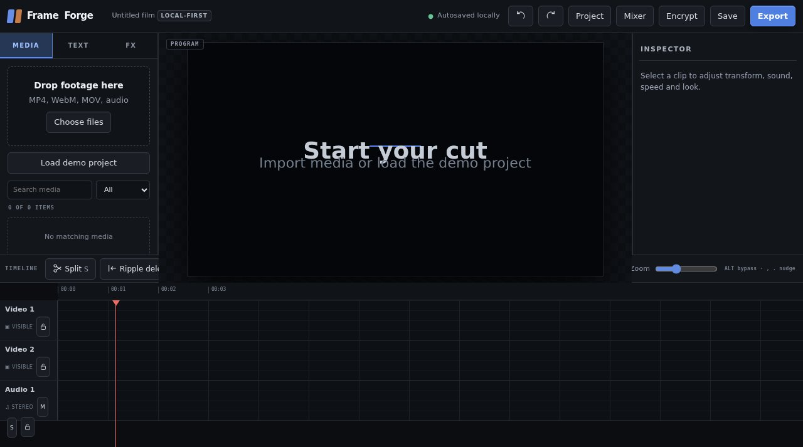

# FrameForge Studio

A local-first browser video editor. Imported media, project state, captions and renders stay on the device. The app has no analytics, cloud sync or application server.



**Live:** https://aeiouvcode.github.io/frameforge-studio/

## Architecture

FrameForge is a JavaScript shell around a native core written in [Zig](https://ziglang.org/) and compiled to WebAssembly.

- **Shell (JavaScript):** interface, timeline model, storage, vault, WebCodecs/MediaRecorder export.
- **Core (Zig → WASM, `core/`):** per-pixel and per-sample kernels. v1 ships 3D LUT grading and exact waveform peaks; the scope histogram kernel is built but stays on JS because it measured at parity.
- Every kernel lands behind a parity test against the JS path (`core/test/parity.mjs`) and a pinned SHA-256. If the core fails to load or verify, the JS path runs unchanged.

Rebuild the core with Zig 0.16.x: `sh core/build.sh`.

## Run on localhost

Python 3:

```sh
python3 -m http.server 4173 --bind 127.0.0.1
```

Open `http://127.0.0.1:4173/`.

Node.js:

```sh
npx --yes serve -l 4173 .
```

Use the Python command when you do not want `npx` to download anything. Do not expose this server on `0.0.0.0` unless you intentionally want other devices on the network to reach it.

## Security model

- Local-only IndexedDB and Origin Private File System storage
- Strict Content Security Policy: same-origin connections only (the app's own vendored assets); no forms, frames, plugins or base URL changes
- Blob/data media only
- Context-correct HTML escaping for imported names and captions
- Input size/type validation
- No API keys or secrets

The hosted GitHub Pages copy is the same static client. Pages serves files only; editing and storage remain in the browser.

## Auto Cut local model pack

The bundle vendors ONNX Runtime Web and the Silero VAD ONNX model under `vendor/`. `vendor/SHA256SUMS` records every shipped runtime/model asset. No CDN is used. WebAssembly requires the narrow CSP capability `wasm-unsafe-eval`; ordinary JavaScript eval remains blocked. The first analysis can take longer while local model files are read and compiled.
